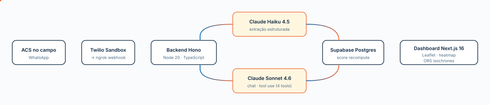

<p align="center">
  
</p>

<p align="center">
  <a href="https://impact-acs-rio.vercel.app"></a>
  <a href="https://www.anthropic.com/"></a>
  
  
  
  
  
</p>

<p align="center">
  <b>🌐 Acessar em produção:</b> <a href="https://impact-acs-rio.vercel.app">impact-acs-rio.vercel.app</a>
</p>

> Submissão para o **Claude Impact Lab Rio 2026** · tema **Inteligência no Território** (Saúde da Família · SMS Rio).

---

## TL;DR

Os ACS do Rio fazem 1,2M+ visitas/ano, mas **metade dos cadastros nunca recebeu uma visita** e **54% dos pacientes pós-urgência não têm followup em 30 dias**. O gargalo não é trabalho — é **priorização** e **captura**. Criamos um mini-ERP que junta os dois lados:

- O ACS conta a visita pelo WhatsApp em texto livre → o Claude estrutura → o paciente já entra atualizado na reunião semanal da equipe.
- A reunião acontece em cima de um dashboard institucional (visual SMS Rio) com **score composto de prioridade**, **heatmap territorial** e **chat IA contextual** que consulta o banco em tempo real.

> **Princípio:** o sistema some na captura (WhatsApp, o canal que o ACS já usa) e aparece na decisão (a reunião onde se define a semana).

<p align="center"></p>

## Por que importa (impacto quantificado)

EDA completo do dataset SMS Rio em [docs/analise-completa-dataset-saude.md](docs/analise-completa-dataset-saude.md).

| Indicador | Número | O que isso significa |
|---|---|---|
| Cadastros sem visita em 1 ano | **48.838 / 97.938 (50%)** | Metade do território é invisível pra equipe |
| Pacientes pós-urgência sem followup 30d | **54,4%** (mediana 36d) | Janela crítica de adesão perdida |
| Pacientes "fantasma" (sem visita E sem evento clínico) | **43%** | Nem ACS sabe que existem, nem sistema viu |
| Idosos 66+ sem visita no ano | **12.636** | População de altíssimo risco invisível |

A solução **não cria novo trabalho** — reorganiza o trabalho que já é feito, com priorização orientada por dados e captura no canal que o ACS já usa todo dia.

<p align="center"></p>

## Como o Claude está no produto

| Onde | Modelo | Para quê |
|---|---|---|
| **Ingestão** (webhook WhatsApp) | **Haiku 4.5** | Extrai de texto livre do ACS um JSON estruturado: sintomas, alertas, ações tomadas, gravidade |
| **Chat da reunião** | **Sonnet 4.6 + tool use** | 4 ferramentas read-only (`query_patients`, `query_alerts`, `query_kpis`, `query_group_stats`). Claude decide quais chamar e compõe a resposta. |
| **Score composto** | regras + Haiku | 4 eixos: clínico, social, temporal, gatilho |

<p align="center"></p>

## Arquitetura

<p align="center">
  
</p>

**Três planos integrados:**

1. **Plano de captura** — ACS no campo · WhatsApp · Twilio Sandbox · webhook Hono · Haiku 4.5 extrai e persiste.
2. **Plano de decisão** — reunião semanal em cima do dashboard Next.js: lista priorizada por score, heatmap Leaflet, isócronas a pé (OpenRouteService).
3. **Plano de exploração** — chat IA com tool use: a equipe pergunta em linguagem natural, o Claude consulta o Postgres ao vivo.

<p align="center"></p>

## Stack & serviços

| Camada | Tecnologia | Por que |
|---|---|---|
| Frontend | Next.js 16 (App Router) · React 19 · Tailwind v4 · Leaflet · Cera Pro | Brand Prefeitura Rio + mapas vetoriais leves |
| Backend | Node 20 · TypeScript · Hono 4 · `postgres` (porsager) | Webhook rápido, sem framework gordo |
| Banco | **Supabase** Postgres (`Hackaton-Claude-Impact`, us-east-1) | Schema versionado em `supabase/migrations/` |
| IA | **Anthropic** Claude Sonnet 4.6 + Haiku 4.5 via `@anthropic-ai/sdk` | Tool use + extração estruturada |
| WhatsApp | **Twilio** Sandbox via SDK oficial | Canal nativo do ACS |
| Geocode/Isócronas | **OpenRouteService** (proxy server-side) | Tempo a pé para sedes de equipe |
| Túnel local | **ngrok** | Webhook público para o Twilio |
| Dados origem | 4 Parquets anonimizados SMS Rio (`_inbox/data/`) | Cidadão · profissional · agendamento · encontro |

<p align="center"></p>

## Setup

```bash
git clone https://github.com/peterflagdooor/impact-acs-rio.git
cd impact-acs-rio

cp src/backend/.env.example  src/backend/.env
cp src/frontend/.env.example src/frontend/.env.local

supabase link --project-ref <seu-project-ref>
supabase db push

(cd src/backend  && npm install && npm run dev) &   # :3001
(cd src/frontend && npm install && npm run dev) &   # :3000

ngrok http 3001
# Twilio Console → Sandbox webhook = https://<id>.ngrok.io/webhook/whatsapp
```

Dashboard local: [http://localhost:3000](http://localhost:3000)

**Produção:** [impact-acs-rio.vercel.app](https://impact-acs-rio.vercel.app)

### Testar o fluxo WhatsApp (sandbox)

O backend escuta em `POST /webhook/whatsapp`. Para mandar uma mensagem real e ver o Claude extraindo + persistindo no Supabase, entre no sandbox do Twilio do projeto:

1. No WhatsApp do seu celular, mande para **+1 415 523 8886** a mensagem:
   ```
   join oxygen-rise
   ```
2. Após o "joined" confirmar, mande uma mensagem como se fosse um ACS pós-visita. Exemplo:
   > *Visitei dona Maria, 72 anos, rua X 123. Tá com tosse seca há 3 dias, febre baixa à noite. Pressão 14/9. Pedi pra ir no posto amanhã.*
3. O backend recebe → Haiku 4.5 extrai → registro entra/atualiza no Postgres → aparece na lista priorizada do dashboard em `/pacientes`.

> **Quem está autorizado:** o sandbox do Twilio aceita apenas números previamente cadastrados como *Sandbox Participants*. Para adicionar mais testadores, peça o `join oxygen-rise` para cada celular ou cadastre o número no Twilio Console → *Messaging → Try it out → Send a WhatsApp message → Sandbox settings*.
>
> **Token novo / sandbox próprio:** se for usar outra conta Twilio, o código `join <palavra>` muda — pegue o atual no Console e atualize o passo acima.

### `.env.example` (raiz — referência consolidada)

> Em uso real, cada subapp tem o seu: `src/backend/.env` e `src/frontend/.env.local` (ambos gitignored).

```env
# === Backend (src/backend/.env) ===

# Anthropic — Sonnet 4.6 (chat) + Haiku 4.5 (extração)
ANTHROPIC_API_KEY=sk-ant-xxx

# Twilio (WhatsApp Sandbox)
TWILIO_ACCOUNT_SID=ACxxx
TWILIO_AUTH_TOKEN=xxx
TWILIO_WHATSAPP_FROM=whatsapp:+14155238886

# Supabase Postgres (Session pooler — Project Settings → Database → Connection string)
DATABASE_URL=postgresql://postgres.<project-ref>:<password>@aws-1-<region>.pooler.supabase.com:5432/postgres

PORT=3001
PUBLIC_WEBHOOK_URL=https://changeme.ngrok.io

# OpenRouteService — proxy server-side (NÃO expor via NEXT_PUBLIC_*)
ORS_API_KEY=eyJ...

# === Frontend (src/frontend/.env.local) ===

# Vars NEXT_PUBLIC_* são expostas ao browser
NEXT_PUBLIC_API_URL=http://localhost:3001
```

<p align="center"></p>

## Estrutura do repo

```
src/
├── backend/        Hono + Anthropic SDK + postgres + Twilio
│   └── src/routes/ webhook.ts · chat.ts (tool use)
├── frontend/       Next.js 16 (App Router) — /pacientes · /chat
supabase/migrations/  schema versionado (init + fase 2 score flags)
docs/
├── analise-completa-dataset-saude.md      EDA quantitativa do dataset
└── analises-territorio/                   15 análises temáticas + soluções
_inbox/            briefings oficiais, Q&A SMS-Rio, dados Parquet, brandbook
_refs/             repos de referência (read-only — não vão pro git)
```

<p align="center"></p>

## Roadmap

- **Áudio no WhatsApp** — voice notes do ACS via Whisper → Claude (já natural pro canal)
- **Família como entidade** — ACS confirma família em campo, sistema passa a operar família-cêntrico
- **Integração Vitacare** — export/import com o prontuário oficial da SMS Rio
- **Roteirização otimizada** — ORS routing além de isócronas (key já configurada)
- **PWA do ACS** — captura offline-first, sync quando voltar à rede

## Equipe

- **Peter Flag** · [@peterflagdooor](https://github.com/peterflagdooor)
- **Gabriel Tyll** · gabriel.tyll@gmail.com
- **Ricardo Brigante** · ricardo.brigante@gmail.com
- **Vitor Medeiros** · vitoropdm@gmail.com
- **Kadu Bruns** - kadubruns@gmail.com

## Documentação técnica

- [Análise completa do dataset](docs/analise-completa-dataset-saude.md)
- [Análises temáticas + soluções (15 docs)](docs/analises-territorio/README.md)
- [Briefing oficial do desafio](_inbox/briefing-acs-vulnerabilidade.md)
- [Transcrição do Q&A com SMS-Rio](_inbox/transcricao-qa-sms-rio.md)

---
Demonstração

https://drive.google.com/file/d/1J6oxZtzN7DKHvVkrf7oUDOjUuO7DsOY-/view?usp=sharing

<p align="center">
  <sub>Construído em ~36h para o <b>Claude Impact Lab Rio 2026</b> · feito com <a href="https://www.anthropic.com/claude">Claude</a>, café e respeito pelo trabalho dos ACS.</sub>
</p>
